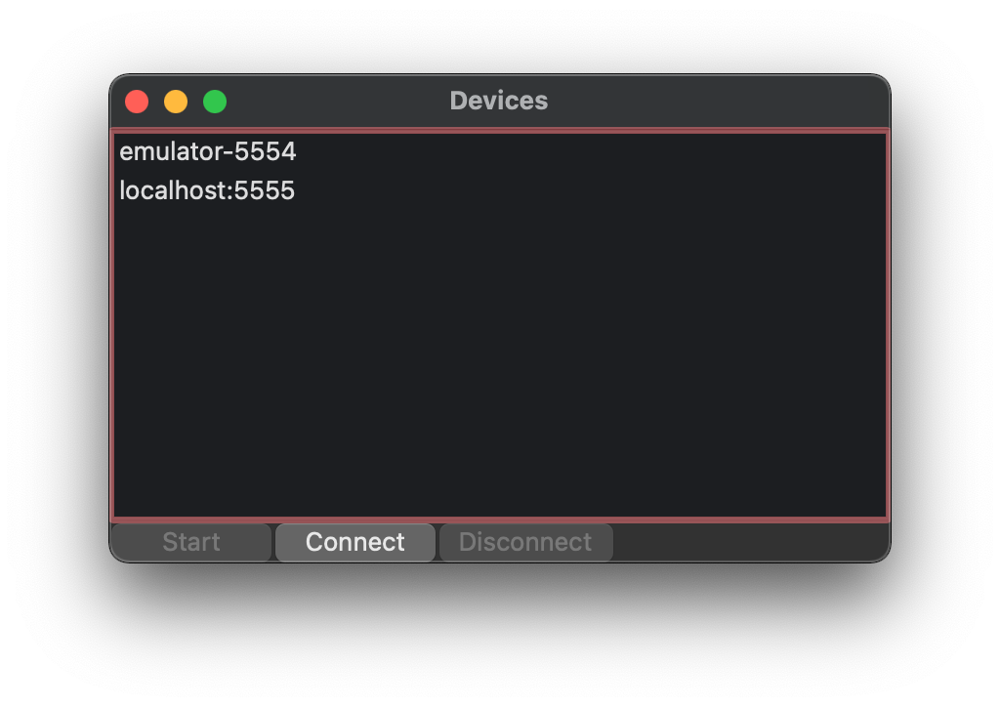
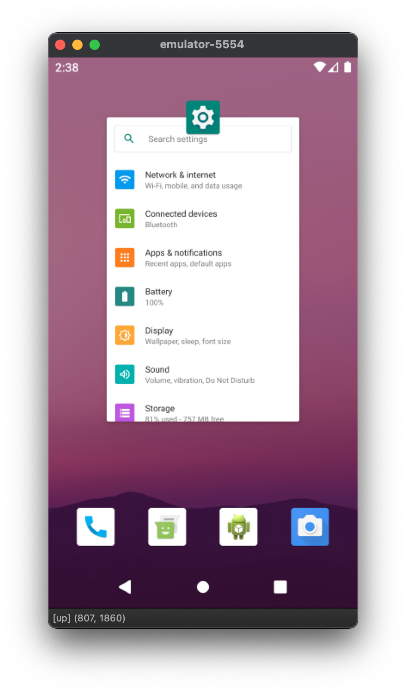

# droidwiz

Provides a basic UI to control an Android device:

* See what is on the screen.
* Tap and swipe.

## The good and the bad

### Advantages

* Needs only _wxPython_, thus it runs on _MacOS_,
_Windows_ and _Linux_.
* Does not need to install an _APK_ to run on the device.
* Free and open-source.
* Simple.

### Limitations

* Poor framerate as it uses `screencap`.
* Swipe gestures update the screen only after the mouse
is released, as it uses the `input` command,
and support for _UP_/_MOVE_/_DOWN_ events has been
removed from _AOSP_.

## UI

### Select device

Select device from the list of local devices, or
use the _connect_ button to connect to a remote one.

### Device screen

Interact with the device via taps and swipes.

## License

Copyright (c) 2020 Svetlin Ankov

Licensed under the MIT license.
